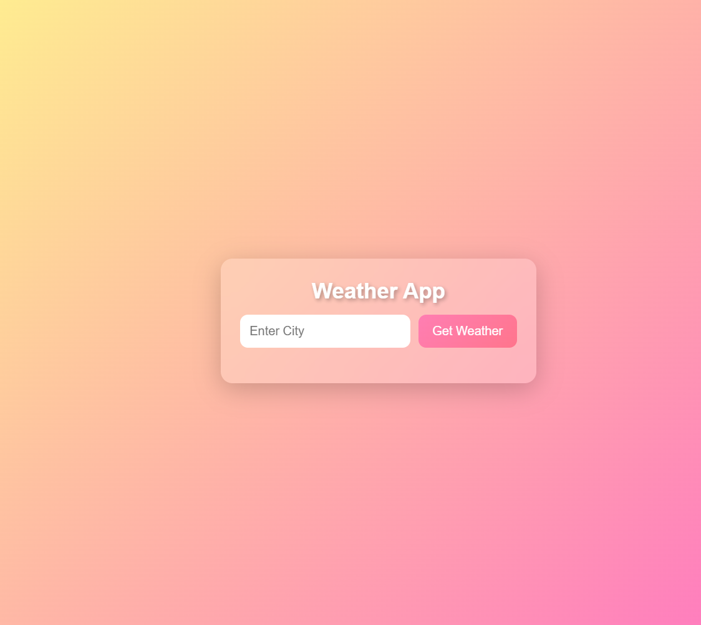
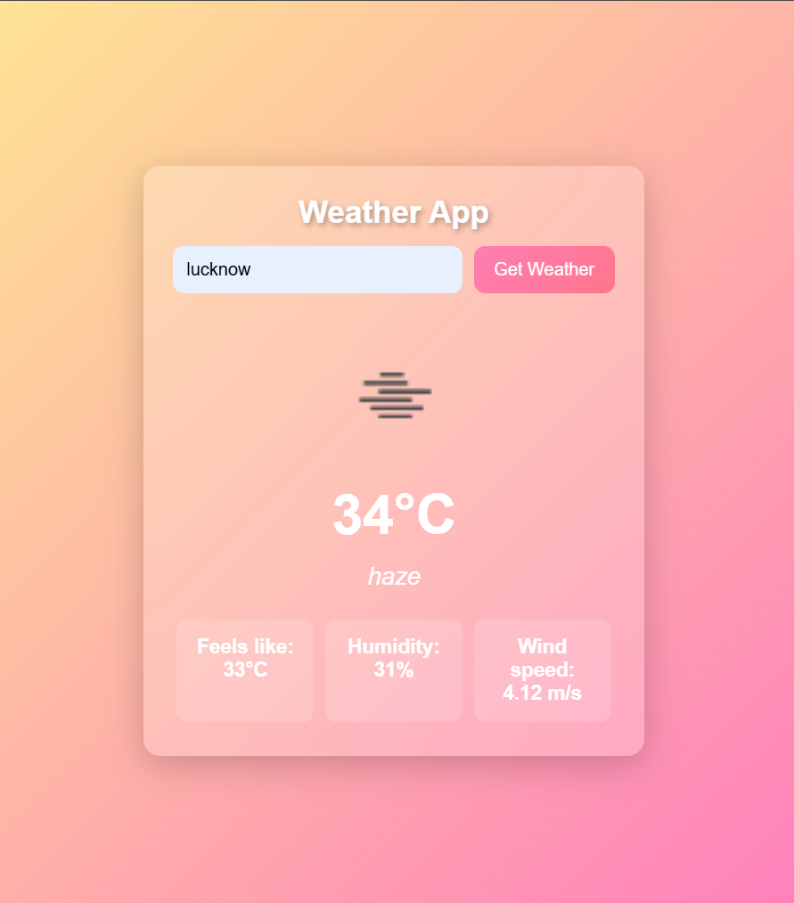

# Weather App

A simple weather application built using HTML, CSS and JavaScript.

## Features
- Search weather by city name
- Shows temperature
- Shows weather condition
- Clean and responsive UI

## Technologies Used
- HTML
- CSS
- JavaScript
- Weather API

## Live Demo
https://shubham-code05.github.io/weather-app/

## Screenshots

### Home Page

### Weather Result

Built as part of my web development learning journey.
